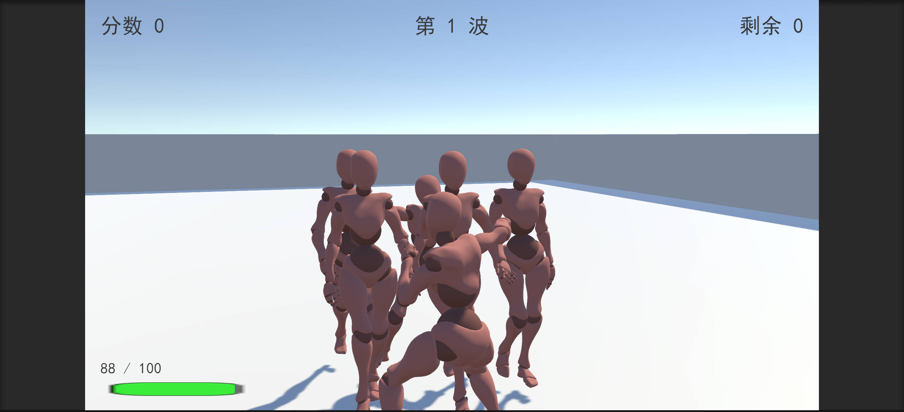
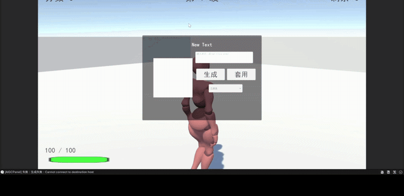
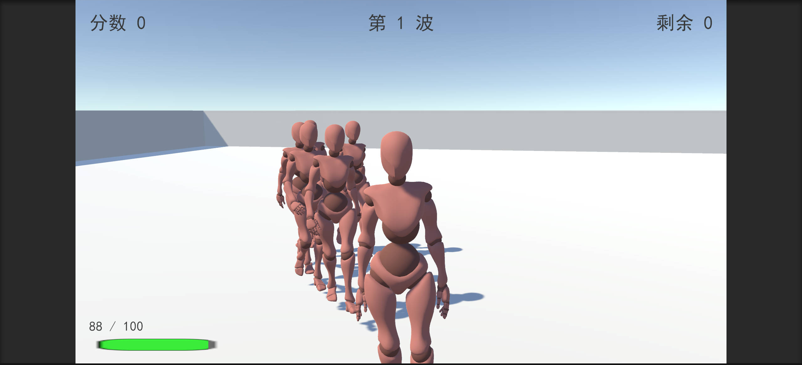
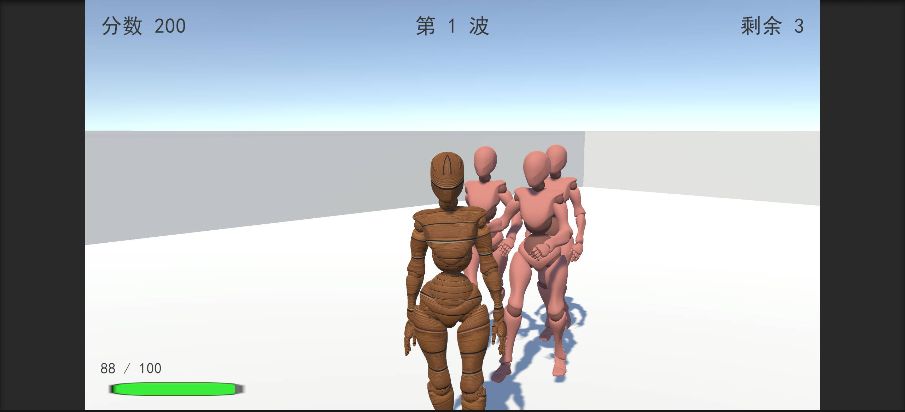

# Action Arena — 第三人称近战动作 Demo

一个使用 **Unity 2022.3 LTS** 开发的第三人称近战动作 · 波次生存游戏 Demo。玩家在竞技场中迎战一波波敌人，近战格斗、闪避求生。

> **特色**：全部美术资产（角色动画、贴图、3D 模型、材质）由自研 [AIGC 资产生成管线](#aigc-资产管线) 产出；并支持**游戏运行时 AI 生成**（IGC）——玩家可在游戏内输入 Prompt，实时生成贴图为角色"换皮"。



## 演示



*移动与镜头 → 近战攻击 → 击杀 → 波次刷新 → 运行时 AIGC 换皮*

## 玩法与操作

| 输入 | 动作 |
|---|---|
| WASD | 移动（相机相对方向） |
| 鼠标左键 | 近战攻击 |
| 鼠标 | 第三人称视角（Cinemachine FreeLook） |
| G | 打开 AIGC 生成面板（运行时换皮） |

核心循环：波次刷怪（Wave1 → Wave2 → 循环）→ 击杀得分 → 敌人 AI 追击反打 → 血量归零 GameOver。

## 技术要点

### 角色 3C
- **CharacterController** 驱动移动（非 Rigidbody），相机相对的输入映射
- **Cinemachine FreeLook** 第三人称跟随镜头
- **新 Input System**（Active Input Handling = Both），代码内绑键零配置
- Locomotion Blend Tree（Idle/Walk/Run 按 Speed 归一化混合），处理 Root Motion 与程序位移的滑步问题

### 战斗系统
- `HitBox` / `HurtBox` / `IDamageable` 命中判定体系：攻击者自身排除、受击回调、击退
- 打击反馈：**HitStop 顿帧**、**镜头震动**、飘字伤害数字
- 事件驱动架构：`EventBus` + `IGameEvent` 结构体，逻辑层与表现层（HUD / 反馈特效）完全解耦

### 敌人 AI 与波次
- NavMesh 寻路追击 + 状态机（Walk / Attack / Die）
- 波次配置 **ScriptableObject** 化（WaveConfig），数据驱动
- 刷怪点用 `NavMesh.CalculatePath` 预校验"到玩家可达"，杜绝生成在围墙外导致波次卡死

### 性能与工程化
- 对象池（ObjectPool）管理敌人、飘字等高频创建销毁对象
- GameManager 全局状态机单例（SingletonBehaviour）
- 自研编辑器扩展：HUD 一键布局、中文字体（SimHei 动态 TMP Atlas）一键配置

### 运行时 AIGC（IGC，差异化功能）
游戏运行中按 `G` 呼出生成面板 → 输入 Prompt → 经 HTTP 调用本地 FastAPI 推理服务 → 生成贴图热替换角色材质：

- 支持 **3 个模型热切换**：二次元风 / 写实风 / 无缝纹理（tileable texture）
- 推理侧 **LCM 加速**（6 步采样，512×512 约 4.2s），本地 RTX 4060 Laptop 即可运行
- 离线模式下 Demo 可独立运行，无 AI 服务依赖

| 换皮前（默认材质） | 换皮后（AI 生成贴图） |
|---|---|
|  |  |

## 项目结构

```
Assets/
├── Game/
│   ├── Scripts/
│   │   ├── Core/      GameManager、EventBus、事件定义
│   │   ├── Input/     GameInput（新 Input System）
│   │   ├── Player/    移动/动画/战斗/生命
│   │   ├── Combat/    HitBox、HurtBox、HitStop、CameraShake
│   │   ├── Enemy/     NavMesh 敌人 AI、刷怪器
│   │   ├── Waves/     WaveConfig(SO)、WaveManager
│   │   ├── Pooling/   对象池
│   │   ├── UI/        HUD、飘字
│   │   ├── AIGC/      RuntimeAIGCClient、生成面板、换皮器
│   │   └── Editor/    HUD 布局 / 字体配置工具
│   ├── Prefabs/  Scenes/  Waves/  Animations/  Fonts/
├── animation/         Mixamo (X Bot) + MoMask 生成动画
├── GeneratedAssets/   AIGC 管线产出的贴图 / 3D 模型 / PBR 材质
└── Editor/AIGCAssetGenerator/   编辑器内 AIGC 资产生成窗口
```

## 运行方式

1. **Unity 2022.3 LTS** 打开本工程，首次导入等待编译
2. 打开场景 `Assets/Game/Scenes/Arena.unity`，直接 Play
3. （可选）运行时 AIGC 换皮：另行启动本地推理服务后，Play 中按 `G` 使用；无服务时面板为离线模式，不影响游玩

## AIGC 资产管线

本 Demo 的美术资产由一条自研 AIGC 管线产出（Stable Diffusion + LoRA / ControlNet / LCM、TripoSR 图生 3D、StableMaterials PBR 材质、MoMask 文本生成动作），经 Blender headless 减面 / 展 UV / LOD 后导入 Unity。管线代码见 👉 [aigc-game-asset-pipeline](https://github.com/konodioda3939/aigc-game-asset-pipeline)。

## 环境

- Unity 2022.3.62 LTS（Built-in 渲染管线）
- Cinemachine 2.10.7 / Input System 1.14.2 / AI Navigation 1.1.7 / TextMesh Pro 3.0.7

## Roadmap

- [ ] 连击段数扩展（Attack2 / Attack3）
- [ ] GameOver 结算界面
- [ ] 更多敌人类型与精英怪
- [ ] AIGC 生成 3D 武具的运行时装配
